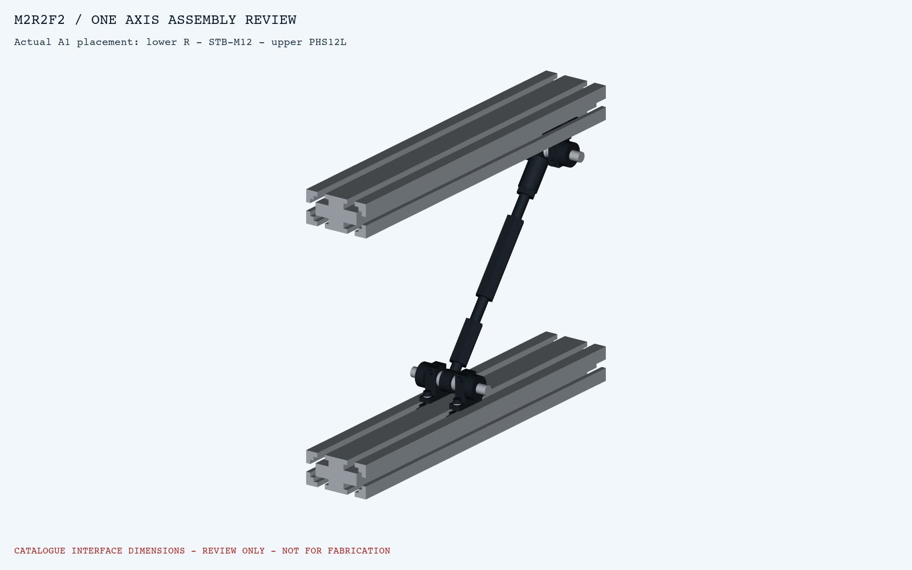
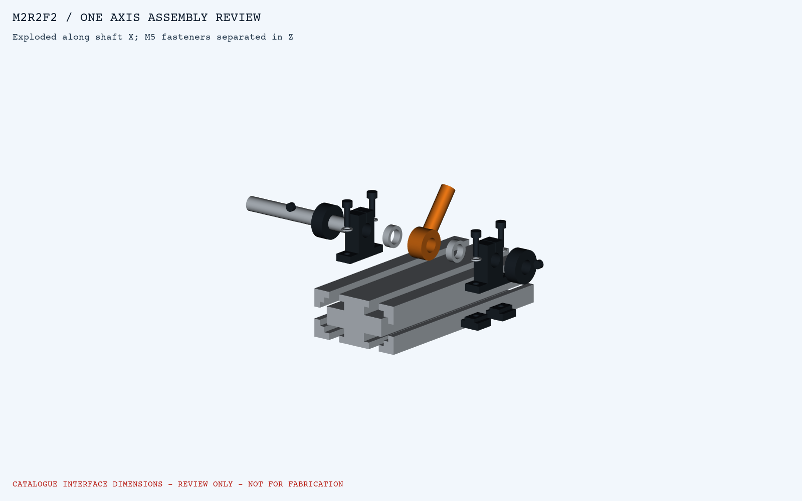
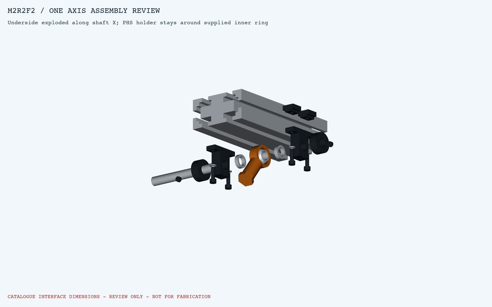

# M2R2F2 한 축 접합부 3D 검토

하부 R - 수동 STB-M12 - 상부 PHS12L로 이어지는 A1 한 축을 실제 배치에서 분리했다. 조립본3개, 분해본2개, STEP5개를 제공한다.

## 바로 볼 파일

- [한 축 전체 STEP](step/A1_COMPLETE_ASSEMBLED_REVIEW.step)
- [하부 조립 STEP](step/A1_LOWER_ASSEMBLED_REVIEW.step) / [하부 분해 STEP](step/A1_LOWER_EXPLODED_REVIEW.step)
- [상부 조립 STEP](step/A1_UPPER_ASSEMBLED_REVIEW.step) / [상부 분해 STEP](step/A1_UPPER_EXPLODED_REVIEW.step)
- [확인 치수·조립 순서·미확정 항목](../../design_basis/manual_m2r2f2_one_axis_assembly_2026-09-05.md)
- [검사 JSON](M2R2F2_ONE_AXIS_AUDIT.json) / [구성요소 목록](COMPONENT_REGISTER.json)

## 하부와 상부

하부 적층은5.9+14+5.9 mm에 총0.2 mm 유격, 상부는5+16+5 mm다. 두 지지대 안쪽 간격26 mm, 축은 Ø12×100 mm다. 모델 축은11.996 mm로 두어 조임 전 보어 반경방향 거리가0.002 mm이며 SHAT12 슬릿 체결로 고정한다.

5개 모델의 예상 밖 교차0건/형상오류0건, STEP5개 재수입 통과. 주물 필릿·나사산·내부 부시·칼라 슬릿 등은 일부 생략했으므로 카탈로그 공칭 치수상 조립/공간 검토 결과다. 실물 끼움, 체결 강도와 허용하중 승인은 아니다.
