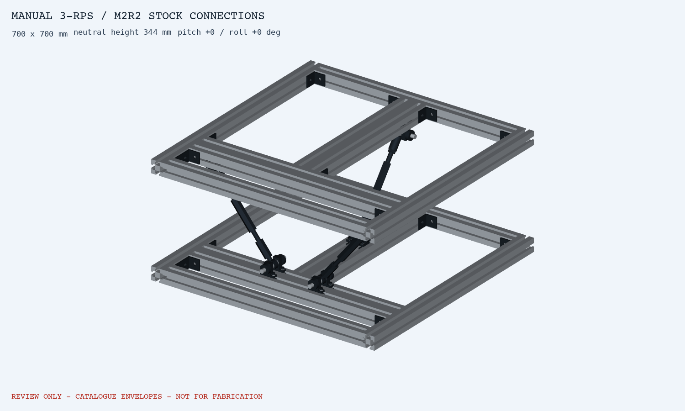

# M2R2 — 기성 연결부 조립 CAD

**프로파일은 절단 주문, 접합부는 기성품 볼트 조립** 조건으로 바꾼 검토본이다. 기존 맞춤 평판과 Ø12/20 부시를 제거했다. 제작 승인 도면은 아니다.

## 변경점

- 턴버클3개 유지, 앞1/뒤2 직교 배치. 상하 프레임을 4040/4080 같은 계열로 통일.
- 관절: 슬롯에 직접 장착하는 SHAT12 두 개 + Ø12 축 + 기성 심 와셔 + 축 칼라.
- 맞춤 가공 부품 0종으로 계획. 정밀축도 카탈로그 길이 지정품이며 별도 끝단 가공 없음.
- 검토 크기700×700×344 mm. 기존보다44 mm 높고, 실제 카트 치수는 반영 전.

## 파일

- [전체 조립 STEP](step/M2R2_NEUTRAL_REVIEW.step)
- [기울어진 자세 STEP](step/M2R2_P3_R3_REVIEW.step)
- [링크 1개 STEP](step/M2R2_SINGLE_LINK_REVIEW.step)
- [부품 후보·절단 길이·조립 순서·근거](../../design_basis/manual_revm2r2_stock_connections_2026-09-05.md)
- [검사 결과 JSON](M2R2_AUDIT.json)

## 검증 결과

|항목|결과|
|---|---|
|모델 구성|156개 구성요소 / 전체 STEP246 솔리드|
|외형 간섭|대표9자세, 모델링한 서로 다른 구성요소 사이 간섭0건(교차부피0.01 mm³ 기준)|
|기구학|±3° 영역169자세, R 구속 rank3 / 링크 잠금 포함 rank6|
|필요 핀 간 길이|260.561~297.349 mm|
|검토 길이 범위|260~300 mm, 최소 내부 나사물림19.326 mm|
|종속 중심 이동|최대 X0.685 / Y0.274 mm, yaw=0 중립 근방 분기|
|STEP 재수입|3개 모두 형상 유효, 최대 부피차0.000014 mm³ 미만|

카탈로그 장착 치수 기반으로 만든 외형 CAD다. 프로파일 내부 단면과 브래킷 형상은 단순화했으며 브래킷 볼트, 지지대 클램프 나사, 칼라 체결나사는 생략했다. 따라서 위 결과는 전체 실물 조립의 모든 간섭·강도·공차 검증 완료를 뜻하지 않는다. 실제 제조사 CAD 기반 최종 검사는 남아 있다.

## 주문 전 남은 항목

1. STB 압축 사용과 지지대/칼라의 정격·체결 조건, 국내 공급/납기.
2. PHS12L 좌나사 및 아이/축/심의 실제 치수와 유격, M5 볼트 물림.
3. 독립 기계 스톱, 하부 고정 및 실제 카트의 위치결정·기계식 래치.

20 kg은 총 지지질량 예비 기준이며 실제 프레임·카트·적재물 합산 전이다. 이 문서는 상부 프레임과 링크 접합부의 무가공 조립안을 완성한 것으로, 전체 장치 구매 릴리스는 아니다.

## 재생성

Python3.12, CadQuery2.8, VTK9.6.2. 프로젝트 루트와 해당 라이브러리 폴더를 PYTHONPATH에 두고 `scripts/build_manual_turnbuckle_rev_m2r2.py` 실행. 이전 M2/M2R1의 형상 유틸리티와 M2 계산 모듈을 함께 사용한다.

이번 Windows 환경의 OneDrive `vendor/python` 접근 오류 때문에 별도 사용자 캐시 `C:/Users/Kangmin/.cache/leveling-cad-runtime`에 실행 의존성을 설치했다. CAD 실행은 결과 파일과 검사 완료 메시지를 기록한 뒤 종료코드1을 반환했다(최소 CadQuery import만 해도 재현). 이 런타임 종료 문제는 해결되지 않았으며 테스트 프로세스 전체가 정상 종료했다고 주장하지 않는다. JSON 결과, 각 STEP 재수입 결과, ZIP 무결성 검사는 구분해서 기록했다.

구매 발주, 공급사 문의 발송, 가공도·DXF, 실물 시험은 실행하지 않았다.
