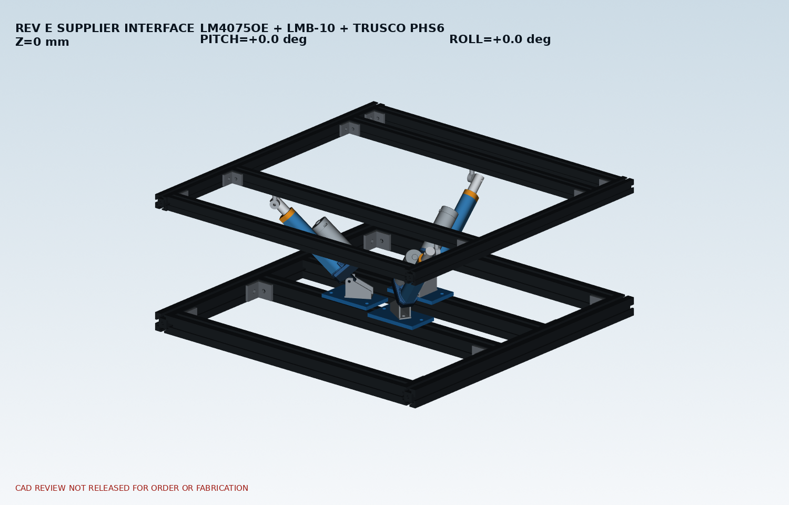
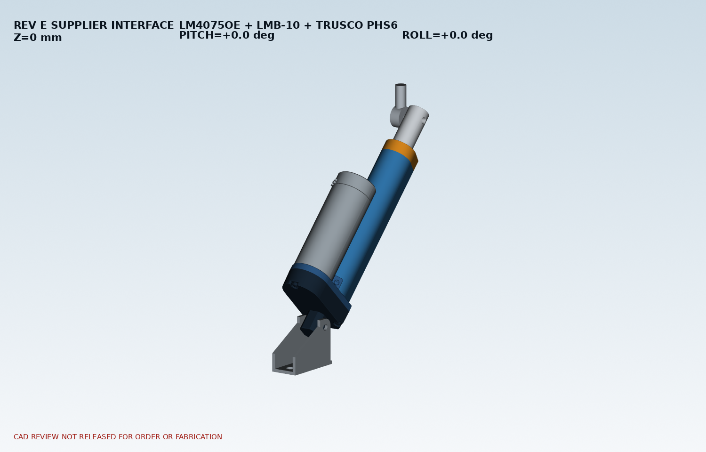

# Rev E 공급품 인터페이스 CAD

## 적용 부품

- 액추에이터: Motorbank `LM4075OE-1075`, 24 V, 100 mm, 공급사 STEP 적용
- 하부 브래킷: Motorbank `LMB-10`, 공개도면 외곽 적용
- 상부 로드엔드: 한국미스미 TRUSCO `PHS6`, 발주코드 `280-7599`, 공개치수 외곽 적용
- 프레임과 120 x 70 x 8 mm 하부 어댑터는 기존 승인 Rev E 배치를 유지

## 최소 수정

TRUSCO PHS6의 보수적 축방향 외곽과 액추에이터 전단 아이가 복합 ±3도 자세에서 미세하게 겹쳐, PHS6를 공통 피벗 핀 축 방향으로 1.5 mm 바깥쪽 이동했다. 실제 조립에서는 M6용 1.5 mm 간격 와셔 또는 등가 shim stack을 사용한다. 프레임이나 어댑터 형상은 변경하지 않았다.

## 디지털 검증 결과

- 자세: Z 0/25/50 mm × pitch -3/0/+3도 × roll -3/0/+3도 = 27자세
- 액추에이터 핀 중심거리 전체 범위: 210.771741–276.937115 mm
- 액추에이터 허용 범위: 205–305 mm
- 최대 비의도 실체 교차체적: 0 mm³
- 결과: 27자세 디지털 조립/간섭검사 PASS

수평 자세의 핀 중심거리는 Z=0에서 224.207493 mm, Z=25에서 242.886805 mm, Z=50에서 262.619497 mm이다.

## STEP 파일

- `step/Profile_Radial_3RPS_RevE_SUPPLIER_COLLAPSED.step`
- `step/Profile_Radial_3RPS_RevE_SUPPLIER_NEUTRAL.step`
- `step/Profile_Radial_3RPS_RevE_SUPPLIER_RAISED.step`
- `step/Profile_Radial_3RPS_RevE_SUPPLIER_P3_R3.step`
- `step/Profile_Radial_3RPS_RevE_SUPPLIER_P3_RM3.step`
- `step/A1_LM4075OE_LMB10_TRUSCO_PHS6_INTERFACE_DETAIL.step`

## 조립 순서

1. 하부 120 x 70 x 8 mm 어댑터를 프로파일에 느슨하게 체결한다.
2. LMB-10을 36 mm 홀 피치에 맞추고 두 볼트를 체결한다.
3. 액추에이터 후단 아이를 LMB-10 내폭 20 mm 사이에 넣고 하부 핀을 삽입한다.
4. 상부 PHS6를 정렬하되 액추에이터 전단 아이에서 핀 축 방향으로 1.5 mm 간격을 둔다.
5. M6 피벗 핀/볼트를 삽입하고 간격 와셔를 설치한다.
6. 세 액추에이터의 핀 중심거리를 약 242.9 mm로 맞춘 뒤 상부 프레임을 지지 블록 위에서 결합한다.
7. 손으로 ±3도 범위를 천천히 움직여 걸림이 없는지 확인한 후 전원을 연결한다.

## 남은 실물 확인

- PHS6 미스미 페이지에는 CAD 다운로드가 없으므로 축방향 폭 10 mm를 보수적 외곽으로 사용했다.
- 수령 후 LMB-10 내폭, PHS6 축방향 폭, 액추에이터 아이 폭을 캘리퍼로 확인한다.
- 체결품과 핀은 이번 공급품 외곽 STEP에서 제외했다. M6 피벗 길이와 와셔 조합은 실측 후 확정한다.
- 기존 기계식 스토퍼 그룹은 내부 리미트만 사용한다는 시제품 범위에 따라 이 출력에서 제외했다.
- 디지털 PASS는 실제 조립, 체결 토크, 배선, 무부하 시운전을 대신하지 않는다. 구매·가공 최종 릴리스는 실물 치수 확인 뒤 결정한다.
